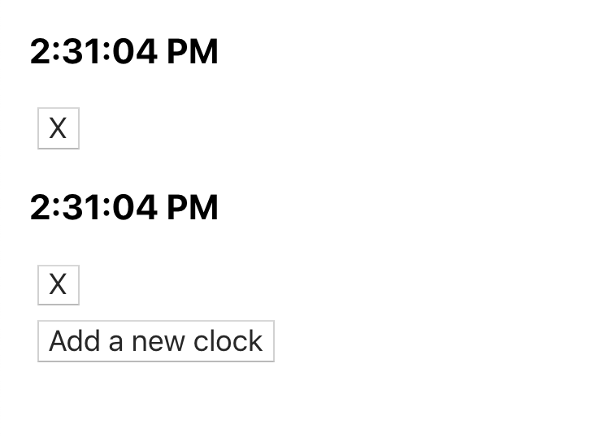

##Goals:

1. Create a clock that will display the current time (hh:mm:ss), updating once each second. It should be possible to display multiple clocks on the page
2. Implement a method that will enable users to delete clocks
3. [Bonus] Implement a method that will enable users to add more clocks

The final product should look something like this:

##Instructions:

1.  Fork and clone this repo
2.  Build out your App component. It should:
    a. keep track of the clock instances
    b. render the Clock component for each instance
3.  Create a Clock component. Each Clock instance should:
    a. keep track of the current time 
    b. update the current time once per second

